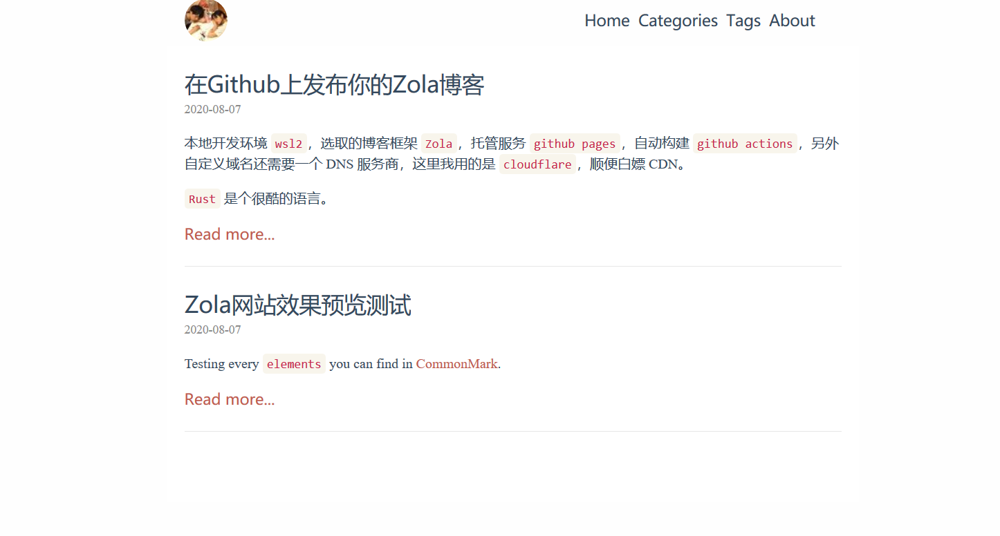

## 博客

博客地址: https://blog.yanshenxian.xyz

当前博客框架用的是 `Zola`，并基于 `Github Actions` 自动构建在 `Github Pages` 上托管。

搭建流程参考 [此文章](https://blog.yanshenxian.xyz/article/build-and-deploy-zola-on-github-pages/)

网站预览图

一些小改动

- 参考 [simple-dev-blog](https://www.getzola.org/themes/simple-dev-blog/) 把头部显示的站点名称改成了头像
- 参考 [anpu](https://www.getzola.org/themes/anpu/) 加了个 footer
- 修改了默认的锚点符号 见 `templates/anchor-link.html`
- favicon.ico 和 sideout.min.js 脚本本地化，见 `static/` 目录，主题里面用的 cdn 访问速度太慢了
- 修改文章路径以 `article` (sub section) 子目录开头，还可以根据年/月来创建子文件夹，但是子目录的 `_index.md` 必须包含 `transparent = true` 的配置
- 集成 [utteranc](https://utteranc.es/) 评论，相关配置 `config.extra.comment_repo`、`config.extra.enable_comment`、`page.extra.enable_comment`
- 所有外链新标签打开 `config.extra.enable_target_blank`
- ...
